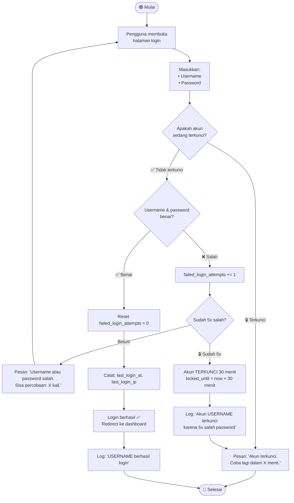
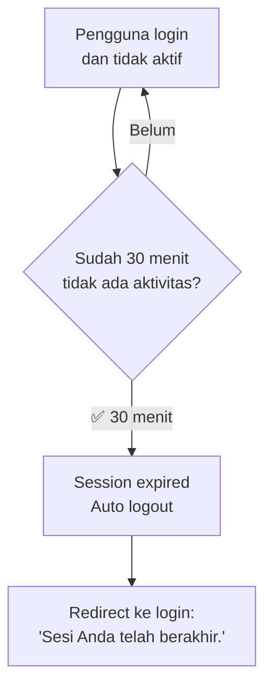

# Activity Diagram — Keamanan Login (Admin & Pimpinan)

## Deskripsi

Hanya **Admin/Pengurus dan Pimpinan/Kepala** yang memiliki akun login di sistem. Anggota koperasi **tidak memiliki akun** — mereka mengakses fitur terbatas via link guest tanpa login.

## Mekanisme Keamanan

| Aspek | Detail |
|-------|--------|
| **Login** | Username + Password (bcrypt) |
| **Rate Limiting** | 5x salah → akun terkunci 30 menit |
| **Session Timeout** | 30 menit tidak aktif → auto logout |
| **Konfigurasi** | Semua batas bisa diubah via pengaturan (teknis) |

## Diagram: Login

## Diagram: Session Timeout

## Catatan

- **Tidak ada fitur ubah PIN/password untuk anggota** — karena anggota tidak punya akun
- Pengurus yang lupa password harus menghubungi admin lain atau pimpinan
- Semua aktivitas login tercatat di `log_aktivitas`
