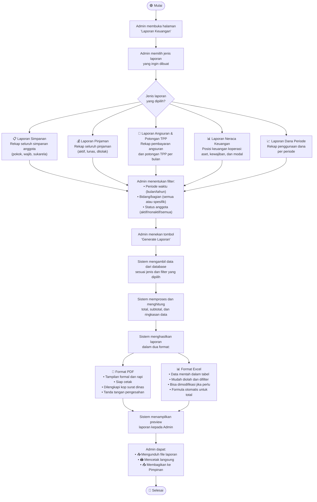

# Activity Diagram — Pembuatan Laporan Keuangan

## Deskripsi Proses

Proses pembuatan laporan keuangan koperasi yang dapat di-generate oleh **Admin Koperasi** kapan saja. Laporan dihasilkan dalam **dua format**: PDF (untuk dibaca dan dicetak) dan Excel (untuk diolah lebih lanjut). Sistem menyediakan beberapa jenis laporan yang mencakup seluruh aspek operasional koperasi.

## Aktor yang Terlibat

- **Admin Koperasi** — Memilih jenis laporan, filter periode, dan meng-generate laporan
- **Pimpinan Koperasi** — Melihat dan mengunduh laporan yang sudah dibuat
- **Sistem** — Mengambil data, memproses perhitungan, dan menghasilkan dokumen laporan

## Diagram

## Jenis-jenis Laporan

### 1. 📋 Laporan Simpanan
| Informasi | Keterangan |
|-----------|------------|
| Konten | Daftar seluruh anggota beserta total simpanan (pokok + wajib + sukarela) |
| Filter | Per bulan, per tahun, per bidang |
| Kegunaan | Mengetahui total dana simpanan yang terkumpul |

### 2. 💰 Laporan Pinjaman
| Informasi | Keterangan |
|-----------|------------|
| Konten | Daftar semua pinjaman, nominal, tenor, status, sisa angsuran |
| Filter | Per periode, per status, per bidang |
| Kegunaan | Memantau total pinjaman yang beredar dan yang sudah lunas |

### 3. 📅 Laporan Angsuran & Potongan TPP
| Informasi | Keterangan |
|-----------|------------|
| Konten | Rekap potongan TPP setiap peminjam per bulan |
| Filter | Per bulan, per anggota |
| Kegunaan | Dokumen resmi potongan TPP untuk arsip dinas dan koperasi |

### 4. 📊 Laporan Neraca Keuangan
| Informasi | Keterangan |
|-----------|------------|
| Konten | Posisi keuangan: total aset (piutang + kas), kewajiban (simpanan anggota), modal (SHU) |
| Filter | Per bulan, per tahun |
| Kegunaan | Mengetahui kesehatan keuangan koperasi secara keseluruhan |

### 5. 📈 Laporan Dana Periode
| Informasi | Keterangan |
|-----------|------------|
| Konten | Total dana awal, total yang sudah dipinjamkan, sisa dana, jumlah peminjam |
| Filter | Per periode |
| Kegunaan | Memantau penggunaan alokasi dana koperasi per periode |

## Catatan Penting

- Laporan dapat di-generate **kapan saja** — tidak harus menunggu akhir bulan atau akhir periode
- Format **PDF** dirancang agar formal dan bisa langsung dicetak sebagai dokumen resmi
- Format **Excel** dirancang agar data bisa diolah lebih lanjut jika terdapat kendala teknis di sistem
- Semua laporan yang pernah di-generate tersimpan di sistem dan bisa diunduh ulang
