# Activity Diagram — Neraca Keuangan Koperasi

## Deskripsi

Neraca keuangan menunjukkan **posisi keuangan koperasi** pada suatu waktu tertentu. Data dihitung **real-time** dari seluruh transaksi yang tercatat di sistem.

## Komponen Neraca

| Komponen | Isi | Sumber Data |
|----------|-----|-------------|
| **ASET** | Kas + Piutang Pinjaman | Saldo kas + sisa pinjaman belum lunas |
| **KEWAJIBAN** | Simpanan Seluruh Anggota | Pokok + Wajib + Sukarela + SWP |
| **MODAL** | Dana Cadangan + SHU | Pendapatan bunga + dana resiko + biaya admin |

> **Rumus:** ASET = KEWAJIBAN + MODAL

## Diagram

```mermaid
flowchart TD
    MULAI([🟢 Mulai]) --> A["Admin/Pimpinan membuka<br/>'Neraca Keuangan'"]

    A --> B["Memilih periode:<br/>• Per bulan (Maret 2026)<br/>• Per tahun (Tahun 2026)"]

    B --> C["Sistem menghitung ASET:"]
    C --> C1["💵 Kas dan Bank<br/>= Total simpanan masuk<br/>+ Total angsuran masuk<br/>+ Dana resiko + Biaya admin<br/>− Pencairan pinjaman (95%)<br/>− Pengembalian simpanan keluar"]
    C1 --> C2["📋 Piutang Pinjaman<br/>= Sisa pokok pinjaman<br/>yang belum dilunasi"]
    C2 --> C3["TOTAL ASET = Kas + Piutang"]

    C3 --> D["Sistem menghitung KEWAJIBAN:"]
    D --> D1["Simpanan Pokok (seluruh anggota)"]
    D1 --> D2["Simpanan Wajib (akumulasi)"]
    D2 --> D3["Simpanan Sukarela (saldo)"]
    D3 --> D4["SWP (Simpanan Wajib Pinjam)"]
    D4 --> D5["TOTAL KEWAJIBAN"]

    D5 --> E["Sistem menghitung MODAL:"]
    E --> E1["Pendapatan Bunga (dari angsuran)"]
    E1 --> E2["Dana Resiko (1,5% dari pinjaman)"]
    E2 --> E3["Biaya Admin (0,5% dari pinjaman)"]
    E3 --> E4["TOTAL MODAL"]

    E4 --> F{"ASET = KEWAJIBAN + MODAL?"}
    F -- "✅ Seimbang" --> G["Tampilkan neraca"]
    F -- "⚠️ Selisih" --> G1["Peringatan: ada selisih"]
    G1 --> G

    G --> H["📄 Unduh PDF / 📊 Excel / 🖨️ Cetak"]
    H --> SELESAI([🔴 Selesai])
```

## Contoh Tampilan Neraca — Per 30 April 2026

| **ASET** | | **KEWAJIBAN & MODAL** | |
|----------|----------|----------------------|----------|
| **Aset Lancar** | | **Kewajiban (Simpanan Anggota)** | |
| Kas dan Bank | Rp 45.000.000 | Simpanan Pokok | Rp 1.000.000 |
| Piutang Pinjaman | Rp 62.500.000 | Simpanan Wajib | Rp 4.000.000 |
| | | Simpanan Sukarela | Rp 2.000.000 |
| | | SWP (Simpanan Wajib Pinjam) | Rp 1.500.000 |
| | | **Total Kewajiban** | **Rp 8.500.000** |
| | | | |
| | | **Modal** | |
| | | Pendapatan Bunga | Rp 3.750.000 |
| | | Dana Resiko | Rp 375.000 |
| | | Biaya Admin | Rp 125.000 |
| | | Dana Cadangan | Rp 94.750.000 |
| | | **Total Modal** | **Rp 99.000.000** |
| | | | |
| **TOTAL ASET** | **Rp 107.500.000** | **TOTAL KEWAJIBAN + MODAL** | **Rp 107.500.000** |

## Sumber Data

| Komponen | Tabel | Cara Hitung |
|----------|-------|-------------|
| Kas | simpanan, angsuran, pinjaman, penarikan | Masuk − Keluar |
| Piutang | pinjaman, angsuran | Sisa pokok belum bayar |
| Simpanan | simpanan − penarikan | Per jenis (Pokok/Wajib/Sukarela/SWP) |
| Pendapatan Bunga | angsuran (komponen bunga yang sudah dibayar) | SUM bunga lunas |
| Dana Resiko | pinjaman.potongan_dana_resiko | SUM dari pinjaman berjalan/lunas |
| Biaya Admin | pinjaman.potongan_biaya_admin | SUM dari pinjaman berjalan/lunas |

## Kemandirian Dana

> ✅ **Seluruh dana koperasi berasal 100% dari sumber internal:** simpanan anggota, pendapatan bunga, dana resiko, dan biaya admin. **Tidak ada dana dari pihak luar.**

| Bukti | Penjelasan |
|-------|------------|
| Tidak ada pos "Utang ke Pihak Ketiga" | Kewajiban hanya simpanan anggota |
| Modal dari operasional sendiri | Bunga + dana resiko + biaya admin |
| Siklus dana tertutup | Anggota setor → dipinjamkan → dikembalikan → setor lagi |
