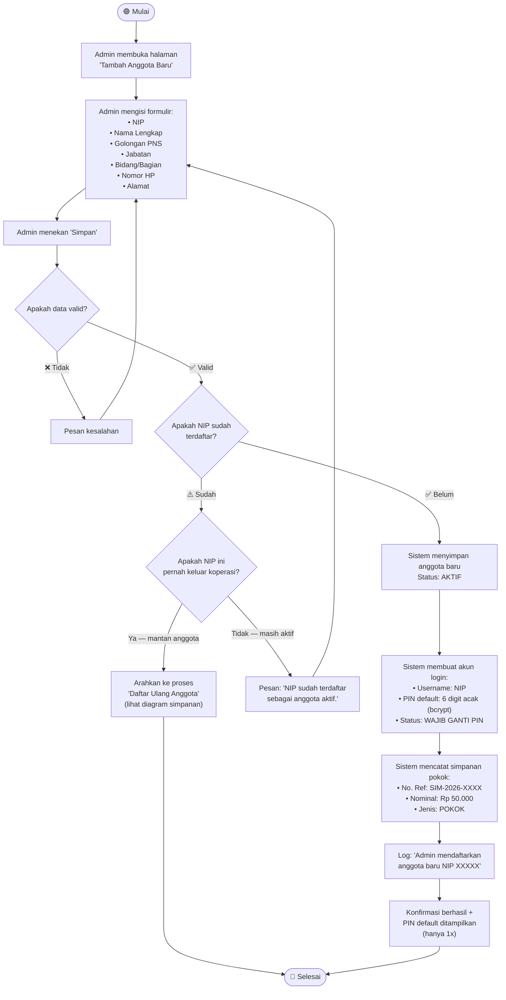

# Activity Diagram — Pendaftaran Anggota Baru

## Deskripsi

Proses pendaftaran anggota baru ke koperasi. Dilakukan oleh **Admin** setelah menerima data dari calon anggota. Setelah berhasil, sistem otomatis: mencatat **simpanan pokok Rp 50.000**, membuat **akun login dengan PIN default**, dan menghasilkan **nomor referensi** transaksi.

## Diagram

## Keamanan PIN

| Aspek | Detail |
|-------|--------|
| PIN Default | 6 digit angka acak (bcrypt) |
| Wajib Ganti | Saat login pertama |
| Tidak Boleh | Sama dengan NIP, berurutan (123456), berulang (111111) |
| Batas Salah | 5x → kunci 30 menit |

## Catatan

- **Simpanan pokok Rp 50.000** dicatat otomatis (nominal bisa diubah via pengaturan)
- PIN default **hanya ditampilkan sekali** — admin tidak bisa melihat lagi setelah halaman ditutup
- Jika NIP pernah keluar, sistem mengarahkan ke **proses daftar ulang** (harus setor kembali simpanan)
