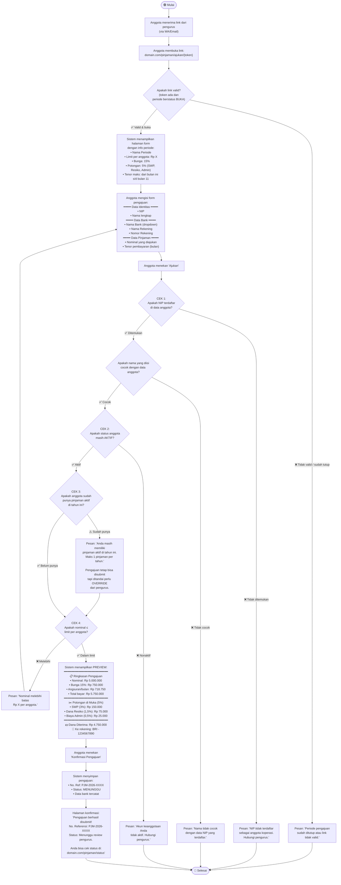
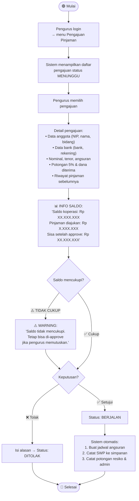
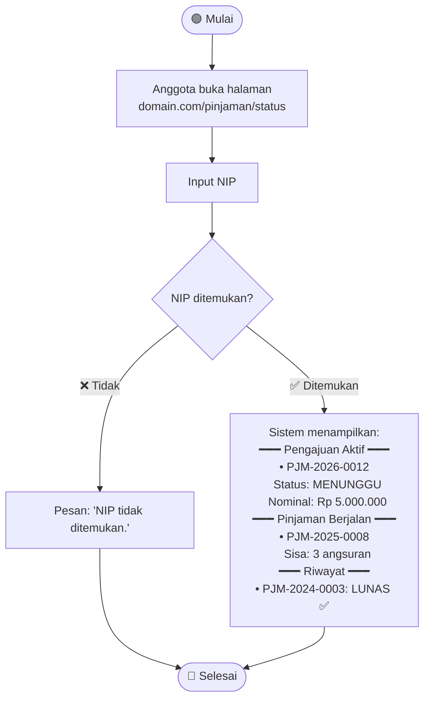

# Activity Diagram — Pengajuan Pinjaman (Guest Form via Link)

## Deskripsi

Anggota mengajukan pinjaman **tanpa login** — melalui **link guest** yang dibagikan oleh pengurus saat periode pinjaman dibuka. Sistem mencocokkan NIP yang diinput dengan data anggota yang sudah ada di sistem.

## Alur Lengkap

```
Pengurus buka periode → Sistem generate link unik
→ Pengurus share link ke anggota (WA/Email)
→ Anggota buka link → Isi form (NIP + bank + nominal + tenor)
→ Sistem cocokkan NIP → Cek kelayakan otomatis
→ Pengajuan masuk antrian → Pengurus review & approve/tolak
```

## Diagram: Anggota Mengajukan Pinjaman via Link Guest



## Diagram: Pengurus Review & Approve



## Diagram: Anggota Cek Status (Guest)



## Pengecekan Otomatis (Ringkasan)

| Tahap | Dicek | Jika Gagal |
|-------|-------|------------|
| 1 | NIP terdaftar & nama cocok | Tolak: "NIP tidak terdaftar" |
| 2 | Anggota masih aktif | Tolak: "Akun tidak aktif" |
| 3 | Belum punya pinjaman aktif tahun ini | Tandai: perlu override pengurus |
| 4 | Nominal ≤ limit per anggota | Tolak: "Melebihi batas" |
| Saat approval | Saldo koperasi mencukupi | Warning (bisa override) |
