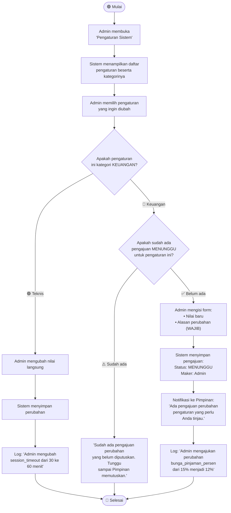
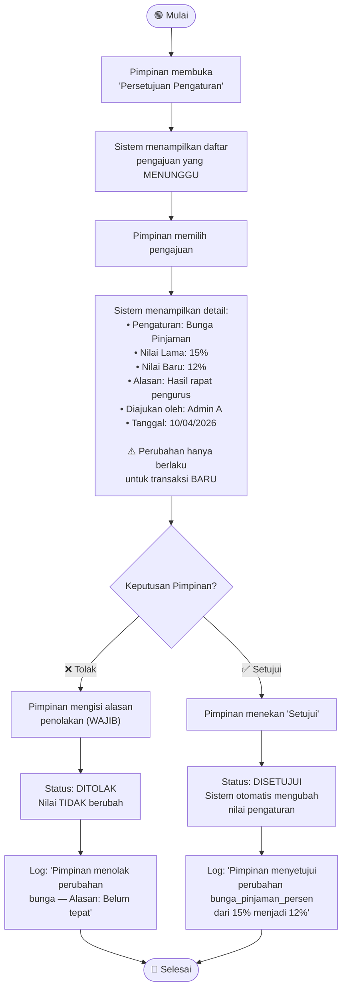

# Activity Diagram — Pengaturan Sistem (Maker-Checker)

## Deskripsi

Pengaturan sistem dibagi 2 kategori: **keuangan** (butuh persetujuan Pimpinan) dan **teknis** (admin bisa ubah langsung). Pola **Maker-Checker** menjamin bahwa perubahan konfigurasi keuangan yang berdampak pada uang anggota tidak bisa dilakukan sepihak.

## Daftar Pengaturan

### 🔴 Pengaturan Keuangan (Perlu Persetujuan Pimpinan)

| Key | Default | Deskripsi |
|-----|---------|-----------|
| bunga_pinjaman_persen | 15 | Bunga TOTAL per pinjaman (%) |
| potongan_swp_persen | 3 | Potongan SWP dari pinjaman (%) |
| potongan_dana_resiko_persen | 1.5 | Potongan dana resiko (%) |
| potongan_biaya_admin_persen | 0.5 | Potongan biaya admin (%) |
| simpanan_pokok | 50000 | Simpanan pokok saat daftar (Rp) |
| simpanan_wajib | 50000 | Simpanan wajib bulanan (Rp) |
| batas_bulan_pelunasan_default | 11 | Bulan terakhir pelunasan |
| tenor_minimal | 1 | Tenor minimal (bulan) |

### 🟢 Pengaturan Teknis (Admin Bisa Ubah Langsung)

| Key | Default | Deskripsi |
|-----|---------|-----------|
| maks_percobaan_login | 5 | Maks salah PIN sebelum kunci |
| durasi_kunci_akun_menit | 30 | Durasi kunci akun (menit) |
| session_timeout_menit | 30 | Timeout sesi (menit) |

## Diagram: Admin Mengajukan Perubahan Pengaturan Keuangan

## Diagram: Pimpinan Menyetujui/Menolak Perubahan

## Aturan Penting

- Perubahan **tidak retroaktif** — hanya berlaku untuk transaksi baru
- Hanya boleh ada **1 pengajuan aktif** per pengaturan
- **Alasan wajib diisi** baik saat mengajukan maupun menolak
- Semua perubahan **tercatat di log aktivitas** dengan nilai lama dan baru
