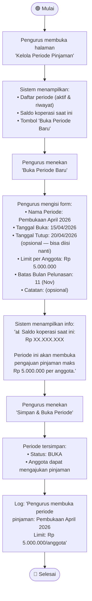
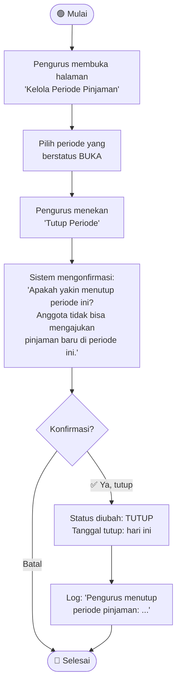
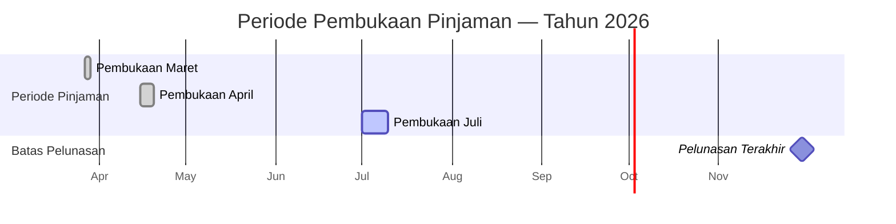

# Activity Diagram — Pembukaan dan Pengelolaan Periode Pinjaman

## Deskripsi

Periode pembukaan pinjaman **dibuka dan ditutup secara manual** oleh pengurus/kepala koperasi. Bisa dibuka **berkali-kali dalam setahun** dengan rentang tanggal yang fleksibel. Anggota hanya bisa mengajukan pinjaman saat ada periode yang berstatus **BUKA**.

## Aturan Periode

| Aturan | Detail |
|--------|--------|
| **Pembukaan** | Manual oleh pengurus, bisa kapan saja |
| **Penutupan** | Manual, atau sesuai tanggal tutup yang ditentukan |
| **Frekuensi** | Bisa berkali-kali dalam setahun |
| **Limit** | Ditentukan per pembukaan (fleksibel) |
| **Tenor maks** | Default: dari bulan pengajuan sampai bulan pelunasan (default 11) |
| **Saldo koperasi** | Tidak ada minimal saldo untuk membuka periode |
| **Catatan** | Pengurus bisa menambahkan catatan/alasan pembukaan |

## Diagram: Membuka Periode Pinjaman Baru

## Diagram: Menutup Periode Pinjaman

## Contoh Timeline Periode dalam Setahun

## Catatan Penting

- **Tidak ada validasi minimal saldo** saat membuka periode — validasi saldo terjadi saat **approval pinjaman**
- **Tanggal tutup bisa dikosongkan** — pengurus bisa menutup secara manual kapan saja
- Pengurus bisa **membuka periode baru** meskipun periode sebelumnya baru saja ditutup
- Setiap periode memiliki **limit per anggota sendiri** — bisa berbeda antar periode
- **Pinjaman yang sudah diajukan** di periode yang ditutup tetap bisa diproses (approval/tolak)
