# Activity Diagram — Pencatatan Potongan Bulanan (TPP)

## Deskripsi

Setiap bulan, pengurus koperasi memotong TPP anggota untuk: simpanan wajib, angsuran pinjaman, dan potongan lainnya. Sistem **hanya mencatat** potongan yang sudah terjadi — sistem tidak melakukan transaksi langsung.

> **Prinsip:** Sistem fokus pada **berapa yang dipotong**, bukan berapa TPP yang dimiliki anggota. Nominal TPP anggota bisa berubah sewaktu-waktu dan tidak perlu disimpan di sistem.

## Diagram

```mermaid
flowchart TD
    MULAI([🟢 Mulai — Setiap Bulan]) --> A["Admin membuka halaman<br/>'Catat Potongan Bulanan'"]

    A --> B["Admin memilih bulan & tahun<br/>yang akan dicatat"]

    B --> C["Sistem menampilkan daftar<br/>seluruh anggota aktif beserta<br/>potongan yang perlu dicatat:"]

    C --> D["Untuk setiap anggota, sistem<br/>otomatis menghitung:"]

    D --> D1["1️⃣ Simpanan Wajib<br/>= Rp 50.000 (dari pengaturan)"]
    D1 --> D2["2️⃣ Angsuran Pinjaman<br/>= Rp 718.750 (jika ada pinjaman aktif,<br/>diambil dari jadwal angsuran bulan ini)"]
    D2 --> D3["3️⃣ Potongan Lainnya<br/>= Rp 0 (jika ada potongan tambahan)"]
    D3 --> D4["📊 Total Potongan Bulan Ini<br/>= Rp 50.000 + Rp 718.750 + Rp 0<br/>= Rp 768.750"]

    D4 --> E["Sistem menampilkan tabel rekap:<br/>━━━━━━━━━━━━━━━━━━━━━━━━━━━━━━<br/>Anggota A: Wajib 50rb + Angsuran 718rb = 768rb<br/>Anggota B: Wajib 50rb + Angsuran 0 = 50rb<br/>Anggota C: Wajib 50rb + Angsuran 500rb = 550rb<br/>━━━━━━━━━━━━━━━━━━━━━━━━━━━━━━<br/>TOTAL POTONGAN BULAN INI: Rp 1.368.750"]

    E --> F["Admin memeriksa dan<br/>mengonfirmasi potongan"]

    F --> G{"Apakah semua<br/>potongan sudah benar?"}
    G -- "❌ Ada yang perlu diubah" --> H["Admin menyesuaikan potongan<br/>untuk anggota tertentu<br/>(misalnya ada potongan lainnya)"]
    H --> E

    G -- "✅ Sudah benar" --> I["Admin menekan<br/>'Konfirmasi Potongan'"]

    I --> J["Sistem menyimpan potongan bulanan<br/>dan otomatis:"]
    J --> J1["• Mencatat simpanan wajib<br/>  untuk setiap anggota"]
    J1 --> J2["• Mencatat pembayaran angsuran<br/>  (update status angsuran: LUNAS)"]
    J2 --> J3["• Status potongan: DIKONFIRMASI"]

    J3 --> K["Log: 'Admin mencatat potongan<br/>bulanan April 2026 untuk X anggota.<br/>Total: Rp X.XXX.XXX'"]

    K --> SELESAI([🔴 Selesai])
```

## Contoh Rekap Potongan Bulanan — April 2026

| Anggota | NIP | Simpanan Wajib | Angsuran Pinjaman | Lainnya | **Total** |
|---------|-----|---------------|-------------------|---------|-----------|
| Budi Santoso | 19850101 | 50.000 | 718.750 | 0 | **768.750** |
| Siti Aminah | 19900215 | 50.000 | 0 | 0 | **50.000** |
| Ahmad Rizki | 19880310 | 50.000 | 500.000 | 0 | **550.000** |
| **TOTAL** | | **150.000** | **1.218.750** | **0** | **1.368.750** |

## Catatan Penting

- Admin **tidak perlu menginput nominal TPP** anggota — cukup konfirmasi bahwa potongan sudah dilakukan
- Angsuran pinjaman **otomatis terisi** dari jadwal angsuran yang sudah dibuat saat pinjaman disetujui
- **Tidak ada keterlambatan** — karena potongan langsung dari TPP oleh pengurus tanpa konfirmasi anggota
- Potongan yang sudah dikonfirmasi **otomatis mencatat** simpanan wajib dan pembayaran angsuran
