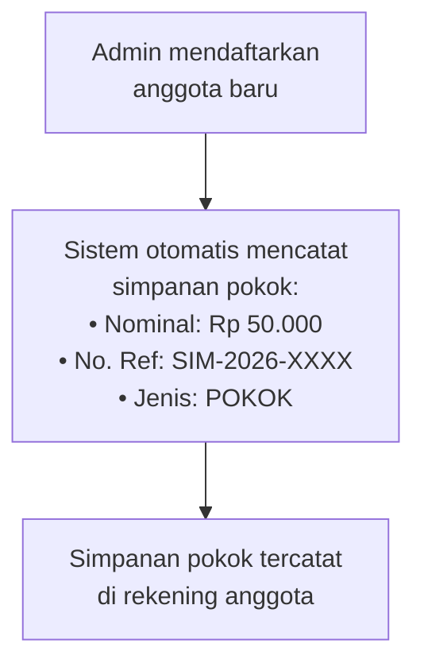
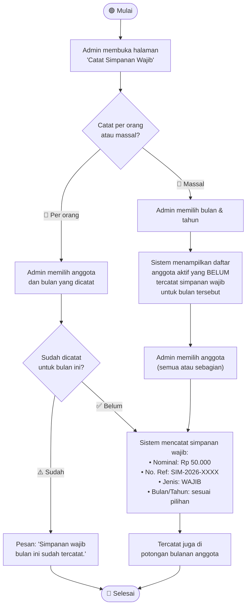
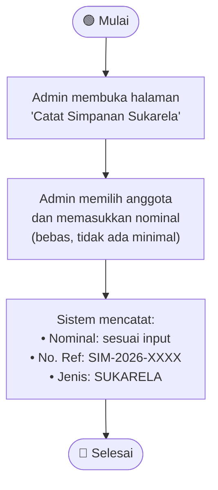
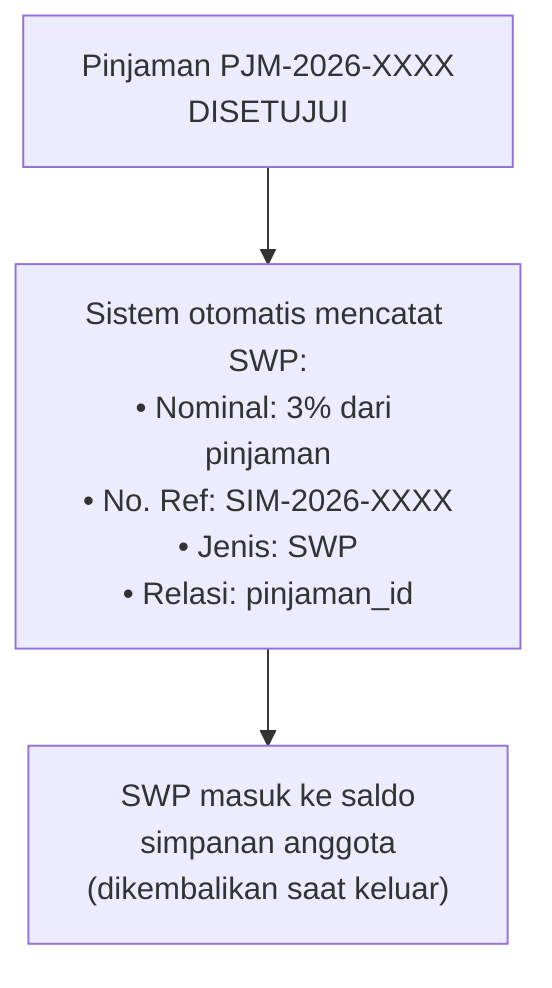
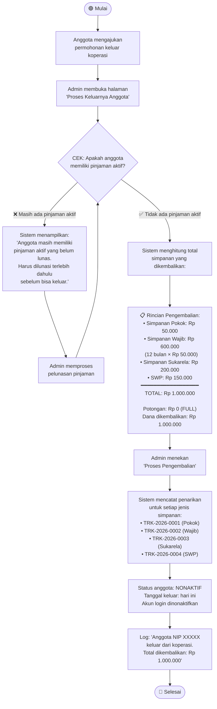
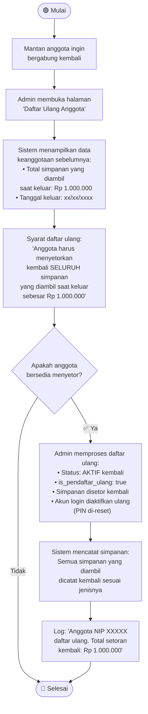

# Activity Diagram — Proses Simpanan

## Deskripsi

Dokumen ini mencakup seluruh proses yang berkaitan dengan simpanan anggota koperasi. Terdapat **4 jenis simpanan** dan **3 proses utama**.

## Jenis Simpanan

| Jenis | Kode | Nominal | Kapan | Bisa Ditarik? |
|-------|------|---------|-------|---------------|
| **Simpanan Pokok** | POKOK | Rp 50.000 | 1x saat daftar | ❌ Tidak (kecuali keluar) |
| **Simpanan Wajib** | WAJIB | Rp 50.000/bulan | Setiap bulan | ❌ Tidak (kecuali keluar) |
| **Simpanan Sukarela** | SUKARELA | Bebas | Kapan saja | ❌ Tidak (kecuali keluar) |
| **SWP** | SWP | 3% dari pinjaman | Otomatis saat pinjam | ❌ Tidak (kecuali keluar) |

> ⚠️ **Aturan utama:** SEMUA jenis simpanan **tidak bisa ditarik** selama anggota masih aktif. Simpanan hanya dikembalikan **FULL tanpa potongan** saat anggota **keluar dari koperasi**.

---

## Proses 1: Pencatatan Simpanan Pokok (Saat Daftar)

---

## Proses 2: Pencatatan Simpanan Wajib Bulanan

---

## Proses 3: Pencatatan Simpanan Sukarela

---

## Proses SWP (Simpanan Wajib Pinjam — Otomatis)

SWP **tidak dicatat manual** oleh admin. SWP otomatis tercatat saat **pinjaman disetujui**:

---

## Proses Keluar Koperasi (Pengembalian Semua Simpanan)

---

## Proses Daftar Ulang (Anggota yang Pernah Keluar)

## Catatan Penting

- **Simpanan pokok dan wajib dipotong langsung dari TPP** oleh pengurus — anggota tidak perlu konfirmasi
- **SWP otomatis** saat pinjaman disetujui — tidak perlu input manual
- **Tidak ada penarikan** selama masih anggota aktif — untuk jenis simpanan apapun
- **Pengembalian FULL** tanpa potongan saat keluar — setelah semua pinjaman lunas
- **Daftar ulang** mengharuskan setoran kembali seluruh simpanan yang pernah diambil
