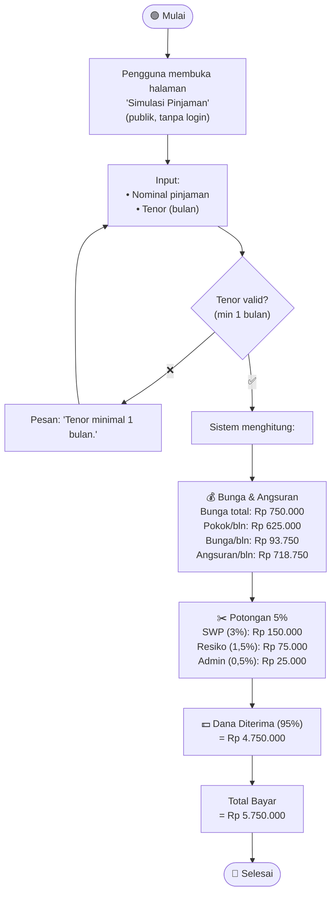

# Activity Diagram — Simulasi Pinjaman (Publik)

## Deskripsi

Simulasi pinjaman bisa diakses **siapa saja tanpa login dan tanpa NIP**. Hanya menghitung estimasi angsuran, bunga, potongan, dan dana yang diterima.

## Rumus

| Komponen | Rumus |
|----------|-------|
| Total Bunga | Nominal × 15% |
| Bunga/bulan | Total Bunga ÷ Tenor |
| Pokok/bulan | Nominal ÷ Tenor |
| **Angsuran/bulan** | **Pokok + Bunga** |
| Total Bayar | Nominal + Total Bunga |
| Potongan SWP (3%) | Nominal × 3% |
| Potongan Resiko (1,5%) | Nominal × 1,5% |
| Potongan Admin (0,5%) | Nominal × 0,5% |
| Total Potongan (5%) | SWP + Resiko + Admin |
| **Dana Diterima** | **Nominal − 5%** |

## Diagram

## Contoh Hasil (Pinjam 5 Juta, 8 Bulan)

| Komponen | Nilai |
|----------|-------|
| Nominal | Rp 5.000.000 |
| Bunga 15% | Rp 750.000 |
| Angsuran/bulan | Rp 718.750 |
| Total bayar | Rp 5.750.000 |
| Potongan SWP (3%) | Rp 150.000 |
| Potongan Resiko (1,5%) | Rp 75.000 |
| Potongan Admin (0,5%) | Rp 25.000 |
| **Dana diterima** | **Rp 4.750.000** |
