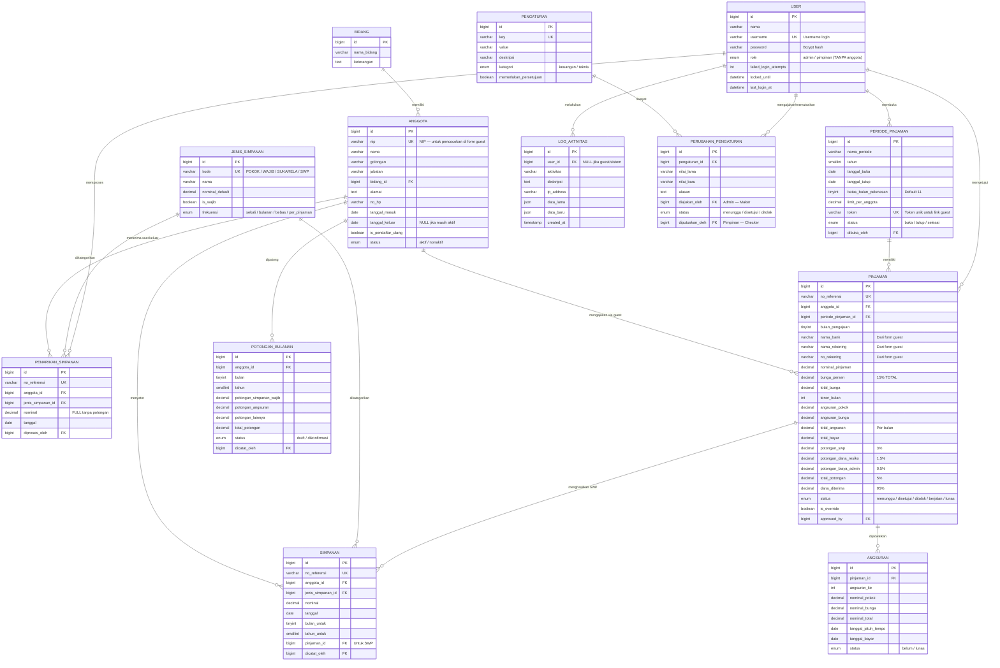
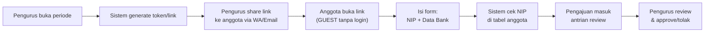
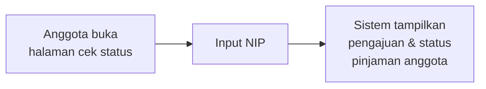

# Entity Relationship Diagram (ERD)

## Deskripsi

ERD sistem koperasi simpan pinjam. **Anggota tidak memiliki akun login** — hanya admin/pengurus dan pimpinan/kepala yang login. Pengajuan pinjaman dilakukan oleh anggota via **link guest** yang dibagikan pengurus.

## Daftar Entitas

| No | Entitas | Kategori | Deskripsi |
|----|---------|----------|-----------|
| 1 | **Bidang** | Master | Bagian/bidang di Dinas PUPR |
| 2 | **Anggota** | Master | Data anggota (pencocokan NIP, bukan login) |
| 3 | **User** | Autentikasi | Akun login — hanya admin & pimpinan |
| 4 | **Jenis Simpanan** | Master | Pokok, Wajib, Sukarela, SWP |
| 5 | **Simpanan** | Transaksi | Catatan setoran |
| 6 | **Penarikan Simpanan** | Transaksi | Pencairan saat keluar koperasi |
| 7 | **Periode Pinjaman** | Master | Pembukaan pinjaman + token link guest |
| 8 | **Pinjaman** | Transaksi | Data pinjaman + bank + potongan 5% |
| 9 | **Angsuran** | Transaksi | Jadwal cicilan |
| 10 | **Potongan Bulanan** | Transaksi | Rekap potongan TPP |
| 11 | **Log Aktivitas** | Audit | Catatan aktivitas |
| 12 | **Pengaturan** | Konfigurasi | Konfigurasi + Maker-Checker |
| 13 | **Perubahan Pengaturan** | Konfigurasi | Riwayat perubahan |

---

## Diagram ERD

---

## Aliran Pengajuan Pinjaman (Guest)

---

## Cek Status (Guest)

