# Use Case Diagram — Sistem Informasi Koperasi Simpan Pinjam

## Aktor

| Aktor | Deskripsi | Akses |
|-------|-----------|-------|
| **Pengunjung** | Siapapun | Simulasi pinjaman publik |
| **Anggota (Guest)** | Karyawan/PNS terdaftar | Via link: ajukan pinjaman + cek status (TANPA login) |
| **Admin/Pengurus** | Pengelola koperasi | Login ke sistem: kelola data, simpanan, pinjaman, laporan |
| **Pimpinan/Kepala** | Ketua koperasi | Login ke sistem: approval pinjaman, pengaturan, neraca |

> ⚠️ **Penting:** Anggota **TIDAK memiliki akun login**. Mereka mengakses fitur terbatas via link guest (pengajuan pinjaman & cek status).

## Diagram

```mermaid
graph TB
    subgraph SISTEM["🏦 Sistem Informasi Koperasi Simpan Pinjam"]
        direction TB

        subgraph PUBLIK["Akses Publik (Tanpa Login)"]
            UC00["Simulasi Pinjaman Umum<br/>(bunga 15%, potongan 5%)"]
        end

        subgraph GUEST["Akses Anggota — Guest (Tanpa Login, Via Link)"]
            UC05["Ajukan Pinjaman via Form Guest<br/>(isi NIP + data bank, sistem cek otomatis)"]
            UC32["Cek Status Pengajuan & Pinjaman<br/>(input NIP → lihat status)"]
        end

        subgraph AUTH["Autentikasi (Admin & Pimpinan)"]
            UC01["Login"]
            UC02["Logout"]
        end

        subgraph ADMIN_ANGGOTA["Admin — Kelola Anggota"]
            UC10["Kelola Data Anggota<br/>(daftar baru + daftar ulang)"]
            UC23["Proses Keluarnya Anggota<br/>(lunasi pinjaman → kembalikan simpanan FULL)"]
        end

        subgraph ADMIN_SIMPANAN["Admin — Kelola Simpanan"]
            UC11["Catat Simpanan Wajib Bulanan<br/>(per orang atau massal)"]
            UC24["Catat Simpanan Sukarela"]
            UC26["Lihat Rekap Simpanan Seluruh Anggota"]
        end

        subgraph ADMIN_PINJAMAN["Admin — Kelola Pinjaman & Periode"]
            UC31["Buka/Tutup Periode Pinjaman<br/>(generate link guest + set limit)"]
            UC12["Tinjau & Proses Pengajuan Pinjaman<br/>(cek saldo + warning jika kurang)"]
            UC13["Catat Potongan Bulanan<br/>(simpanan wajib + angsuran)"]
        end

        subgraph ADMIN_SISTEM["Admin — Sistem & Laporan"]
            UC16["Buat Laporan Keuangan<br/>(PDF & Excel)"]
            UC17["Ajukan Perubahan Pengaturan<br/>(Maker — perlu approval Pimpinan)"]
            UC29["Lihat Log Aktivitas"]
        end

        subgraph PIMPINAN_MENU["Menu Pimpinan/Kepala"]
            UC18["Setujui/Tolak Pinjaman<br/>(atau override 1 pinjaman/tahun)"]
            UC19["Lihat Neraca Keuangan"]
            UC20["Lihat Laporan & Rekap"]
            UC30["Setujui/Tolak Perubahan Pengaturan<br/>(Checker — Maker-Checker)"]
        end
    end

    PUBLIK_USER["🌐 Pengunjung"]
    ANGGOTA["👤 Anggota (Guest)"]
    ADMIN["🔧 Admin/Pengurus"]
    PIMPINAN["👔 Pimpinan/Kepala"]

    PUBLIK_USER --> UC00

    ANGGOTA --> UC00
    ANGGOTA --> UC05
    ANGGOTA --> UC32

    ADMIN --> UC01 & UC02
    ADMIN --> UC10 & UC23
    ADMIN --> UC11 & UC24 & UC26
    ADMIN --> UC31 & UC12 & UC13
    ADMIN --> UC16 & UC17 & UC19 & UC29

    PIMPINAN --> UC01 & UC02
    PIMPINAN --> UC18 & UC19 & UC20 & UC30
```

## Ringkasan Use Case

### 🌐 Pengunjung (Tanpa Login)

| Kode | Use Case | Penjelasan |
|------|----------|------------|
| UC00 | Simulasi Pinjaman Umum | Hitung angsuran, bunga 15%, potongan 5%, dana diterima. Tanpa data pribadi. |

### 👤 Anggota — Guest (Tanpa Login, Via Link)

| Kode | Use Case | Penjelasan |
|------|----------|------------|
| UC05 | Ajukan Pinjaman via Link | Buka link dari pengurus → isi NIP + nama bank + rekening → sistem cocokkan NIP → cek pinjaman aktif → submit |
| UC32 | Cek Status Pengajuan | Input NIP di halaman cek status → lihat semua pengajuan & pinjaman milik NIP tersebut |

### 🔧 Admin/Pengurus (Login)

| Kode | Use Case | Penjelasan |
|------|----------|------------|
| UC10 | Kelola Anggota | Daftar baru + daftar ulang mantan anggota |
| UC23 | Proses Keluar | Lunasi pinjaman → kembalikan simpanan FULL |
| UC11 | Catat Simpanan Wajib | Per orang atau massal, cegah duplikasi |
| UC24 | Catat Simpanan Sukarela | Nominal bebas |
| UC26 | Rekap Simpanan | Filter per jenis, bidang |
| UC31 | Kelola Periode | Buka/tutup periode + generate link guest |
| UC12 | Proses Pinjaman | Review pengajuan + warning saldo |
| UC13 | Catat Potongan Bulanan | Rekap TPP: simpanan wajib + angsuran |
| UC16 | Laporan | PDF + Excel |
| UC17 | Ajukan Perubahan Pengaturan | Maker (Maker-Checker) |
| UC29 | Log Aktivitas | Audit trail |

### 👔 Pimpinan/Kepala (Login)

| Kode | Use Case | Penjelasan |
|------|----------|------------|
| UC18 | Approval Pinjaman | + override 1 pinjaman/tahun |
| UC19 | Neraca | Aset, kewajiban, modal |
| UC20 | Laporan & Rekap | Semua laporan |
| UC30 | Approval Pengaturan | Checker (Maker-Checker) |

> **Dihapus dari versi sebelumnya:** UC03-UC04, UC06-UC09, UC21, UC27, UC28 (semua use case yang memerlukan login anggota). Diganti dengan UC05 (guest form) dan UC32 (guest status check).
